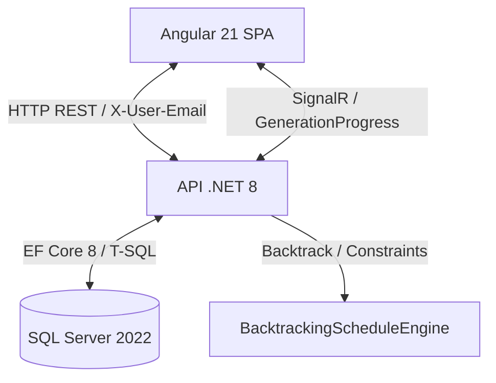
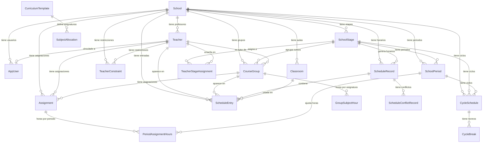
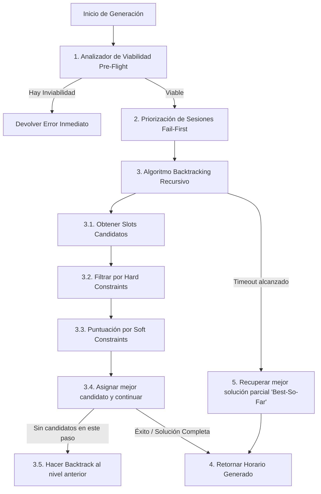

# Guía de Arquitectura del Sistema — Lectivo

Este documento proporciona una descripción técnica detallada de la arquitectura de la aplicación **Lectivo — HorariosEscolares**, un SaaS de generación automática de horarios escolares para centros de educación primaria bajo la normativa LOMLOE.

---

## 1. Vista General del Sistema

El sistema está compuesto por tres componentes principales distribuidos en un modelo cliente-servidor:
1. **Frontend (SPA)**: Aplicación web interactiva desarrollada con **Angular 21** en modo **Zoneless** que utiliza **Signals** para la reactividad de la UI.
2. **Backend (API)**: Servicio HTTP RESTful desarrollado con **.NET 8** y **C#** que implementa una arquitectura híbrida de **Slices Verticales** para endpoints y **Clean Architecture** para el dominio.
3. **Base de Datos**: Motor de base de datos relacional **SQL Server 2022** que almacena el modelo de datos multi-tenant del centro escolar.



---

## 2. Arquitectura del Backend (.NET 8)

El backend de Lectivo adopta un estilo de **Vertical Slice Architecture** para el módulo web (la API) complementado con una estructura de capas clásica de **Clean Architecture** para el núcleo del negocio.

### Estructura de Proyectos
El código fuente en `src/` está dividido en tres proyectos principales que representan el núcleo reutilizable de la aplicación:

1. **`HorariosEscolares.Domain` (Core)**: 
   - Contiene las entidades del dominio, lógica pura, interfaces de servicios y contratos de restricciones.
   - **No tiene dependencias externas** de infraestructura ni de frameworks de base de datos.
2. **`HorariosEscolares.Application`**:
   - Define los casos de uso, abstracciones de persistencia (interfaces de contextos), validadores de negocio y orquestadores.
3. **`HorariosEscolares.Infrastructure`**:
   - Implementa la persistencia real utilizando **EF Core 8** sobre **SQL Server**.
   - Contiene la implementación del motor de asignación de horarios (`BacktrackingScheduleEngine`) y del analizador de viabilidad (`ScheduleViabilityAnalyzer`).

### Vertical Slices en `apps/api`
La interfaz web o punto de entrada (`apps/api`) no utiliza un controlador clásico de tres capas. En su lugar, está organizada en **Slices Verticales** bajo el directorio [Features](file:///d:/Proyectos/Horarios/GeneradorHorarios-be/apps/api/Features):

```
apps/api/Features/
├── Assignments/   # Asignaciones de carga lectiva (profesor-grupo-asignatura)
├── Auth/          # Autenticación simulada y obtención de datos del usuario
├── Classrooms/    # Gestión de espacios y aulas físicas
├── Constraints/   # Restricciones y disponibilidades del profesorado
├── Dev/           # Herramientas de desarrollo y siembra rápida
├── Groups/        # Grupos de alumnos (cursos y secciones)
├── Schedules/     # Ejecución y visualización de horarios, integración con SignalR
├── Schools/       # Configuración global del centro y jornada escolar
├── Subjects/      # Currículo de asignaturas basadas en la LOMLOE
└── Teachers/      # Gestión de la plantilla docente
```

Cada carpeta representa una característica (slice) de principio a fin. Dentro de un slice se definen en el mismo archivo o directorio:
- **Endpoints**: Utilizando **Carter** para el mapeo automático de Minimal APIs.
- **DTOs**: Contratos de entrada y salida exclusivos de la feature.
- **Lógica de negocio**: Implementada directamente en los handlers de los endpoints, accediendo al `DbContext` de EF Core. Esto reduce la duplicidad y la sobrecarga de indirección innecesaria (sin usar MediatR para flujos simples).

---

## 3. Modelo de Dominio y Base de Datos

Lectivo utiliza una base de datos relacional sobre **SQL Server**. Las tablas están diseñadas para soportar **multi-tenancy** aislando los datos mediante el campo `SchoolId`.

### Diagrama Entidad-Relación



### Optimización y Rendimiento
Para evitar *table scans* en entornos multi-tenant (donde todas las consultas filtran por el centro escolar), se implementaron índices secundarios específicos en la base de datos para las siguientes tablas:
- `TeacherConstraints` (índice no agrupado sobre `SchoolId`)
- `Schedules` (índice no agrupado sobre `SchoolId` y `StageId`)
- `ScheduleEntries` (índice no agrupado sobre `SchoolId` y `ScheduleId`)
- `Classrooms` (índice no agrupado sobre `SchoolId`)
- `Assignments` (índice no agrupado sobre `SchoolId`)

### Datos Semiestructurados
Se hace uso de campos de texto serializados en formato **JSON** para almacenar datos dinámicos y evitar sobrecargar el número de tablas relacionales:
- `Teacher.Specialties`: Array JSON de cadenas que almacena las especialidades asignadas al profesor (por ejemplo: `["musica", "ingles"]`).
- `TeacherConstraint.WorkingDays`: Array JSON de enteros que representa los días laborables del colegio (`[1,2,3,4,5]`).
- `ScheduleConflictRecord.Suggestions`: Listado de sugerencias de resolución en JSON.
- `SchoolPeriod.Months`: Meses en los que aplica un periodo específico.

---

## 4. Motor de Generación (Backtracking con Constraint Propagation)

El motor central de asignación (`BacktrackingScheduleEngine`) resuelve un problema de optimización combinatoria clasificado como **NP-duro** (timetabling escolar).

### El Flujo de Generación



### Algoritmo Paso a Paso
1. **Analizador de Viabilidad (`ScheduleViabilityAnalyzer`)**:
   - Evalúa de forma agregada e inmediata antes de lanzar el algoritmo si la configuración tiene posibilidades matemáticas de éxito.
   - Detecta sobrecargas (por ejemplo: si se requieren 30 horas de Educación Física y solo hay un profesor especialista contratado por 25 horas semanales).
   - Genera avisos preventivos accionables sin consumir tiempo de CPU en generación.
2. **Priorización de Sesiones (Heurística *Fail-First*)**:
   - El motor ordena las sesiones a colocar antes de empezar. El orden de asignación es clave: colocar las sesiones difíciles primero minimiza la necesidad de backtracking profundo.
   - Prioridad 1: Sesiones impartidas por especialistas escasos (Música, EF, PT/AL).
   - Prioridad 2: Asignaturas que requieren un tipo de aula específica (por ejemplo, el Gimnasio).
   - Prioridad 3: Resto de asignaturas ordenadas por horas semanales descendentes.
3. **Cálculo de Slots Candidatos**:
   - Identifica las franjas horarias configuradas para la jornada de la etapa (`SlotsPerDay` × `DaysPerWeek`).
   - Descarta automáticamente los slots reservados para **recreos** (`IsBreak == true`), calculados dinámicamente según la configuración de la etapa del colegio.
4. **Validación de Restricciones Duras (`IHardConstraint`)**:
   - Son restricciones físicas no negociables. Si una de ellas se viola, el slot es descartado de inmediato:
     - `TeacherNotDoubleBooked`: Un profesor no puede estar asignado a dos clases diferentes en el mismo slot.
     - `ClassroomNotDoubleBooked`: Un aula no puede albergar a dos grupos de alumnos al mismo tiempo.
     - `TeacherAvailabilityConstraint`: Impide asignar una clase en un día/franja donde el profesor haya marcado no disponibilidad.
     - `MaxWeeklyHoursConstraint`: Asegura que el profesor no trabaje más horas de su límite contratado semanal.
     - `RequiresSpecialistConstraint`: Evita que un docente no especialista imparta asignaturas restringidas (como Inglés o Educación Física).
5. **Evaluación de Restricciones Blandas (`ISoftConstraint`)**:
   - Preferencias pedagógicas y organizativas. Si el slot pasa las restricciones duras, se le calcula una puntuación de penalización matemática (a menor penalización, mejor slot):
     - `NoIntensiveSubjectLastSlot`: Penaliza colocar asignaturas intensivas (Matemáticas/Lengua) en la última hora del día.
     - `DistributeSubjectAcrossDays`: Premia la dispersión uniforme de una asignatura a lo largo de la semana para evitar concentraciones (por ejemplo, evitar dar 3 horas de Matemáticas el mismo día).
     - `TeacherGapsConstraint`: Penaliza los "huecos" o ventanas libres en el horario diario del profesor.
     - `ConsecutiveBlockPreferenceConstraint`: Favorece la creación de bloques consecutivos para asignaturas que lo requieren (como talleres de 2 horas seguidas).
     - `TeacherConsecutiveLoadConstraint`: Limita el número de horas continuadas impartidas por un profesor sin descansos.
6. **Mecanismo Best-So-Far y Cancelación**:
   - Dado que el backtracking puede entrar en bucles de búsqueda muy profundos en problemas complejos, el motor implementa un límite de tiempo por petición (por defecto 30 segundos) soportado por `CancellationToken`.
   - Si se agota el tiempo, el motor no lanza un error genérico; en su lugar, devuelve de manera limpia la **mejor solución parcial encontrada hasta el momento** (la que colocó mayor número de sesiones válidas y con menor penalización).
   - Para las sesiones que quedaron sin colocar, el motor calcula dinámicamente un `ConflictExplanation` explicando las restricciones que colisionaron e impidieron su colocación.

---

## 5. Arquitectura del Frontend (Angular 21)

La SPA está construida sobre una base moderna y eficiente de Angular, optimizada para interactuar fluidamente con la API.

### Características Clave
- **Zoneless (sin Zone.js)**: Angular 21 funciona de manera nativa sin el detector de cambios global. La UI reacciona exclusivamente a través de **Signals** (`writable`, `computed`), lo que incrementa el rendimiento al renderizar la rejilla del horario cuando se realizan arrastres (Drag & Drop) u otras interacciones.
- **Formularios Reactivos**: Gestión estricta de las pantallas de configuración mediante Angular `ReactiveForms` para asegurar validaciones dinámicas del lado del cliente.
- **PrimeNG (Tema Aura)**: La suite de componentes visuales (tablas, diálogos modales, selectores) utiliza PrimeNG. Los estilos nativos del tema se integraron en el sistema de variables de Lectivo para que reaccionen adecuadamente al modo oscuro (`.lectivo-dark`).
- **Media Print CSS**: La vista de horarios generados (`schedule-result`) y del profesor (`my-schedule`) incluye reglas específicas de `@media print` en su hoja de estilos. Esto permite al navegador imprimir el horario maquetado directamente en papel A4 horizontal, eliminando menús de navegación laterales y cabeceras web de forma limpia.

---

## 6. Sincronización en Tiempo Real (SignalR)

Para evitar que el cliente haga *polling* o se bloquee esperando la finalización de un proceso que puede durar hasta 30 segundos, Lectivo utiliza **SignalR** para la comunicación bidireccional.

```
[Cliente] ---- POST /api/schedules/generate ----> [API backend]
                                                  │ (Lanza tarea en background)
[Cliente] <--- HubConnection: GenerationProgress ─┘ (Emite: x/y sesiones asignadas)
[Cliente] <--- HubConnection: Complete/Partial ─── (Termina el proceso)
```

1. El cliente inicia la generación mediante una petición HTTP POST convencional a `/api/schedules/generate`. Esta petición responde con un `Accepted` (202) e inicia el motor en un hilo secundario.
2. El frontend abre de inmediato una conexión WebSocket con el hub de SignalR `/hubs/generation` y se une al grupo del colegio (`SchoolId`).
3. El motor emite eventos de tipo `GenerationProgress` a medida que avanza el algoritmo (cada bloque de sesiones asignadas emite porcentaje actual e hitos del backtracking).
4. Cuando el motor termina (por resolución completa o timeout parcial), emite el evento final de completitud. El frontend recibe este evento, cierra la conexión y redirige a la vista del horario generado cargando los datos desde la BD.

---

## 7. Diseño de Seguridad y Multi-Tenancy

Debido a que el piloto está diseñado para múltiples centros escolares independientes, el aislamiento y la seguridad se estructuran en varias capas:

1. **Autenticación Basada en Header**:
   - En el entorno de desarrollo y piloto actual, el frontend inyecta el correo del usuario en la cabecera `X-User-Email` de todas las peticiones a través de un `HttpInterceptor`.
   - El backend busca al usuario correspondiente en la tabla `AppUser` y carga sus permisos (`Role`) y el identificador de su centro (`SchoolId`).
2. **Defensa Cross-Tenant en Endpoints**:
   - Cada Feature (slice vertical) realiza una comprobación estricta del `SchoolId` del usuario antes de ejecutar cualquier acción de consulta o edición.
   - Si un usuario de un centro *A* intenta modificar recursos de un centro *B* (por ejemplo, editando las horas semanales de una asignatura con un ID arbitrario), el middleware/handler intercepta la petición y responde con un código de estado **403 Forbidden** (implementado usando `Results.StatusCode(403)` para evitar dependencias innecesarias de redirección de Login).
3. **Aislamiento en SignalR**:
   - El método para unirse al grupo de tiempo real del hub de generación (`JoinSchoolGroup`) valida que el ID de grupo solicitado corresponda exactamente con el `SchoolId` registrado para el correo del usuario autenticado en la conexión actual, impidiendo la visualización cruzada de flujos de generación entre diferentes colegios.
