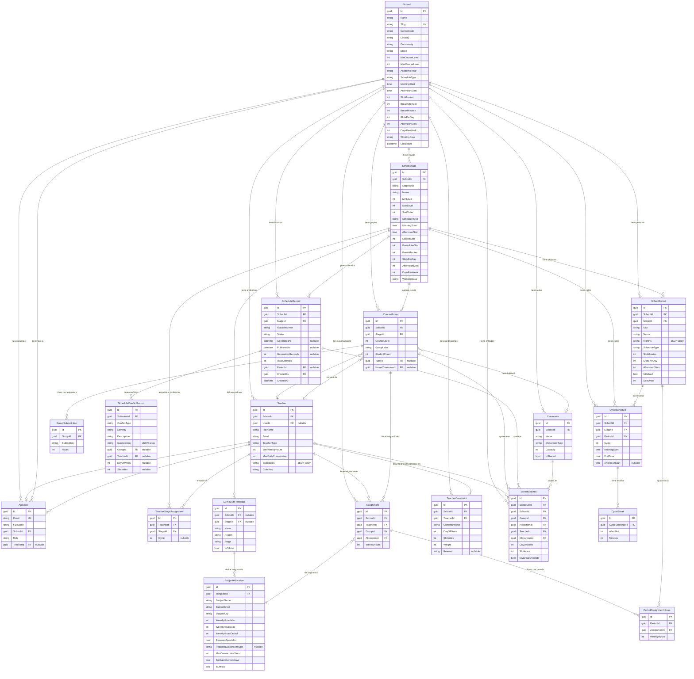

# Diagrama de Base de Datos — Lectivo

> Generado automáticamente. Última actualización: 2026-06-05.

## Diagrama Entidad-Relación

## Índices únicos

| Tabla | Columnas |
|-------|----------|
| `School` | `Slug` |
| `AppUser` | `Email` |
| `Teacher` | `(SchoolId, Email)` |
| `SchoolStage` | `(SchoolId, StageType)` |
| `CourseGroup` | `(StageId, CourseLevel, GroupLabel)` |
| `GroupSubjectHour` | `(GroupId, SubjectKey)` |
| `Assignment` | `(TeacherId, GroupId, AllocationId)` |
| `CycleSchedule` | `(PeriodId, Cycle)` |
| `SchoolPeriod` | `(StageId, Key)` |
| `PeriodAssignmentHours` | `(PeriodId, AssignmentId)` |
| `TeacherStageAssignment` | `(TeacherId, StageId, Cycle)` |

## Notas

- **Campos JSON como string**: `WorkingDays`, `Specialties`, `Suggestions`, `Months` se almacenan como `nvarchar` con contenido JSON.
- **Ciclos educativos**: se resuelven dinámicamente por `CycleResolver` a partir del nivel del curso (`CourseLevel`) y el tipo de etapa (`StageType`).
- **Tablas con nombre personalizado**: `ScheduleRecord` → tabla `Schedules`, `ScheduleConflictRecord` → tabla `ScheduleConflicts`.
- **BD**: SQL Server (contenedor Docker en desarrollo).
